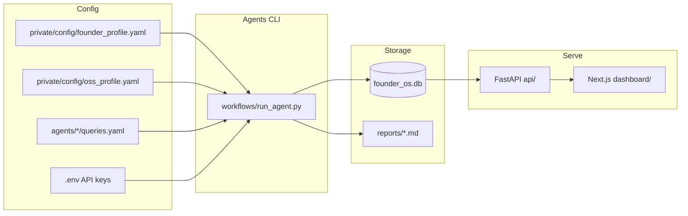

# Founder OS

An internal operating system for solo founders. **Funding Scout** discovers and ranks grants, fellowships, competitions, and accelerators against your founder profile. **OSS Discovery** finds open-source datasets, models, and repos ranked against your language profile. A Next.js dashboard and executive assistant surface the highest-impact opportunities in one place.

Scout is the single source of truth for funding opportunities — grants, fellowships, competitions, and accelerators all live in `scout_opportunities`. The Executive Assistant lets you **track** what you're actively applying to, **pin** priorities, **edit deadlines**, and **save application drafts** without cluttering the briefing with every discovered lead.

## Architecture



## Prerequisites

- Python **3.12+**
- Node **18+** (dashboard)
- At least one search API key for live agent runs (see [.env.example](.env.example))

## Structure

```
founder-os/
├── config/          # Sample configs (*.example.yaml) — safe to publish
├── private/         # Your real profiles, notes, query overrides (gitignored)
├── agents/          # Domain agents (funding_scout, investors, oss_discovery, …)
├── workflows/       # CLI runner + GitHub Actions
├── storage/         # SQLite database + raw exports (gitignored)
├── reports/         # Generated markdown digests (gitignored)
├── dashboard/       # Next.js UI
├── api/             # FastAPI backend
└── lib/             # Shared DB, search, schemas
```

## Quick start

From the repo root:

### 0. Private setup (required for real company data)

Real profiles and sensitive data live under `private/`, which is gitignored. Sample configs in `config/*.example.yaml` are safe to commit and share.

```bash
mkdir -p private/config private/notes private/applications
cp config/founder_profile.example.yaml private/config/founder_profile.yaml
cp config/oss_profile.example.yaml      private/config/oss_profile.yaml
cp config/social_profile.example.yaml   private/config/social_profile.yaml
cp config/features.example.yaml         private/config/features.yaml
# Edit private/config/* with your company details
```

Optional: add company-specific search queries under `private/agents/{agent}/queries.yaml` (merged with public `agents/*/queries.yaml`).

### 1. Backend

```bash
python -m venv .venv
source .venv/bin/activate
pip install -r requirements.txt
cp .env.example .env
uvicorn api.main:app --reload
```

Or without activating the venv:

```bash
./workflows/run_api.sh
```

Use the project `.venv` — system `uvicorn` will fail with `ModuleNotFoundError: No module named 'dotenv'`.

API docs: http://localhost:8000/docs

Demo seed data populates the dashboard on first API start when `SEED_DEMO_DATA=true`.

### 2. Dashboard

```bash
cd dashboard
npm install
cp .env.local.example .env.local
npm run dev
```

Dashboard: http://localhost:3000

### 3. Run agents

```bash
# Ranked scout (recommended first run)
python workflows/run_agent.py --agent funding_scout

# Daily scan: funding_scout + executive_assistant
python workflows/run_agent.py --daily

# Weekly scan: investors, research, oss_discovery
python workflows/run_agent.py --weekly

# OSS datasets, models, and repos (Hugging Face + GitHub + web search)
python workflows/run_agent.py --agent oss_discovery

# All agents
python workflows/run_agent.py --all
```

Add search API keys to `.env` before running funding agents against live search:

- `TAVILY_API_KEY`
- `SERPAPI_KEY`
- `GOOGLE_CSE_KEY` + `GOOGLE_CSE_CX`

For OSS Discovery, optional tokens improve rate limits: `GITHUB_TOKEN`, `HF_TOKEN`.

Without keys, agents run but return no search results. The dashboard still works via demo seed data.

## Configuration

### Environment

Copy [.env.example](.env.example) to `.env`:

| Variable | Purpose |
|----------|---------|
| `FOUNDER_OS_PRIVATE_DIR` | Private data root (default `private/`) |
| `DATABASE_PATH` | SQLite location (default `storage/founder_os.db`) |
| `API_KEY` | Protects `/api/*` routes |
| `CORS_ORIGINS` | Dashboard origin(s) |
| `TAVILY_API_KEY` / `SERPAPI_KEY` / `GOOGLE_CSE_*` | Search providers |
| `SEARCH_FALLBACK_ORDER` | Provider fallback chain ([lib/search/client.py](lib/search/client.py)) |
| `SEED_DEMO_DATA` | Populate demo rows on API startup |
| `GITHUB_TOKEN` / `HF_TOKEN` | Optional — OSS Discovery rate limits (GitHub + Hugging Face) |
| `OSS_DISCOVERY_MAX_PER_QUERY` | Max results per OSS query (default `10`) |

### Founder profile

Edit `private/config/founder_profile.yaml` (copy from [config/founder_profile.example.yaml](config/founder_profile.example.yaml)) to personalize Funding Scout scores:

- Company stage, geography, and description
- Ranking weights under `priorities` (stage fit, AI focus, education, etc.)
- Keyword signals used by [lib/scout/ranker.py](lib/scout/ranker.py)

### OSS profile

Edit `private/config/oss_profile.yaml` (copy from [config/oss_profile.example.yaml](config/oss_profile.example.yaml)) to personalize OSS Discovery scores:

- Target languages and keywords (e.g. Haitian Creole: `ht`, `hat`)
- Ranking weights and recency rules
- Used by [lib/discovery/ranker.py](lib/discovery/ranker.py)

## Agents

| Agent | Schedule | Output | Doc |
|-------|----------|--------|-----|
| `funding_scout` | Daily | `scout_opportunities`, `reports/scout_*.md` | [agents/funding_scout/README.md](agents/funding_scout/README.md) |
| `executive_assistant` | Daily | `executive_briefings` | [agents/executive_assistant/README.md](agents/executive_assistant/README.md) |
| `investors` | Weekly | `investors` | [agents/investors/README.md](agents/investors/README.md) |
| `research` | Weekly | `reports/research_*.md` | [agents/research/README.md](agents/research/README.md) |
| `oss_discovery` | Weekly | `oss_resources`, `reports/oss_*.md` | [agents/oss_discovery/README.md](agents/oss_discovery/README.md) |
| `crm` | Manual | `contacts` (stub) | [agents/crm/README.md](agents/crm/README.md) |
| `social` | Manual | stub | [agents/social/README.md](agents/social/README.md) |

`crm` and `social` are stubs — extend them or ignore until needed. New agents inherit from [lib/agents/base.py](lib/agents/base.py).

## Dashboard

| Route | Description |
|-------|-------------|
| `/` | Overview stats and upcoming deadlines |
| `/scout` | Ranked scout picks (scores, categories, manual saves, **Track** for Assistant) |
| `/assistant` | Executive briefing — priorities, deadlines, tracked applications, drafts |
| `/oss` | OSS datasets, models, repos (Recent · Reference · All) |
| `/social` | Social content drafts |
| `/investors` | Investors |
| `/deadlines` | Redirects to `/assistant` |

Legacy `/funding`, `/grants`, and `/competitions` routes were removed — filter by category on `/scout` instead.

### Executive Assistant workflow

The briefing is intentionally lean. You opt in to what matters instead of seeing every scout hit as an application card.

| Action | Where | Effect |
|--------|-------|--------|
| **Track** | Scout page | Adds opportunity to Assistant **Applications** |
| **+ Add** | Assistant Applications | Pick an untracked scout opportunity to track |
| **Save draft** | Assistant Applications | Saves response text; auto-tracks the opportunity |
| **Untrack** | Assistant Applications | Removes tracking (draft remains if saved) |
| **Pin / Unpin** | Today's priorities | Pinned items always appear at the top |
| **Dismiss 7d** | Today's priorities | Hides from auto-ranking for one week (scout items) |
| **Edit deadline** | Priorities, deadlines, applications | Updates `deadline_at` on scout opportunities |

**Applications** shows only tracked opportunities plus any with a saved draft. **Today's priorities** merges pinned items first, then up to seven auto-ranked items (respecting dismissals).

Manual saves (Add Opportunity form or Scout save) auto-track. Saving a non-empty draft auto-tracks as well.

Key SQLite tables: `scout_opportunities`, `assistant_tracks`, `application_drafts`, `executive_briefings`.

## API endpoints

Interactive docs: http://localhost:8000/docs

| Method | Path | Description |
|--------|------|-------------|
| GET | `/health` | Health check |
| GET | `/api/stats` | Dashboard counts |
| GET | `/api/scout` | Ranked scout opportunities (`category`, `min_score`, `exclude_tracked` filters) |
| PATCH | `/api/scout/{id}` | Update scout opportunity deadline |
| POST | `/api/opportunities/saved` | Save a manual or Twitter-sourced opportunity (auto-tracks) |
| GET | `/api/assistant/tracks` | List assistant track rows |
| PUT | `/api/assistant/tracks/{source_id}` | Pin, track, or dismiss a scout opportunity |
| DELETE | `/api/assistant/tracks/{source_id}` | Remove tracking / pin / dismiss state |
| GET | `/api/applications/{source_table}/{source_id}/draft` | Load application response draft |
| PUT | `/api/applications/{source_table}/{source_id}/draft` | Save application response draft (auto-tracks on non-empty body) |
| GET | `/api/oss` | Ranked OSS resources (`view`, `resource_type`, `min_score` filters) |
| GET | `/api/investors` | List investors |
| GET | `/api/briefing` | Executive assistant briefing |
| GET | `/api/deadlines?days=30` | Upcoming deadlines |
| GET | `/api/contacts` | CRM contacts |
| GET | `/api/agents` | List agent names |
| POST | `/api/agents/run/{name}` | Trigger an agent |
| POST | `/api/agents/run-all` | Run all agents |

All `/api/*` routes require header: `X-API-Key: dev-local-key` (or your `API_KEY`).

## GitHub Actions

Configure secrets in your repo:

| Secret | Purpose |
|--------|---------|
| `TAVILY_API_KEY` | Tavily search |
| `SERPAPI_KEY` | SerpAPI search |
| `GOOGLE_CSE_KEY` | Google Custom Search |
| `GOOGLE_CSE_CX` | Google CSE engine ID |
| `GITHUB_TOKEN` | GitHub Search API (OSS Discovery) |
| `HF_TOKEN` | Hugging Face Hub API (OSS Discovery) |

Workflows:

- **Daily Scan** — `funding_scout`, `executive_assistant` (6am UTC)
- **Weekly Digest** — investors, research, `oss_discovery` (Mon 8am UTC)
- **Manual Agent Run** — pick an agent from the Actions tab

## Public vs private

| Public (committed) | Private (gitignored) |
|--------------------|----------------------|
| Agent code, API, dashboard, docs | `private/config/*.yaml` — real company profiles |
| `config/*.example.yaml` sample configs | `private/notes/` — meeting notes |
| Generic `agents/*/queries.yaml` | `private/applications/` — draft applications |
| `.env.example` | `private/agents/*/queries.yaml` — query overrides |
| | `.env`, `storage/`, `reports/` — keys and runtime data |

Config resolution order: `private/config/{file}` → `config/{file}` → `config/{file}.example.yaml`.

If you open-source this repo, scrub sensitive files from git history before publishing (`.gitignore` only prevents future commits).

## Customization

1. Copy and edit `private/config/founder_profile.yaml` for your stage and thesis
2. Copy and edit `private/config/oss_profile.yaml` for target languages and OSS keywords
3. Tune search queries in `agents/*/queries.yaml` (add overrides in `private/agents/*/queries.yaml`)
4. Run `python workflows/run_agent.py --agent funding_scout` and review `/scout`
5. Track opportunities you want to apply to (Scout **Track** or Assistant **+ Add**)
6. Run `python workflows/run_agent.py --agent executive_assistant` and review `/assistant`
7. Run `python workflows/run_agent.py --agent oss_discovery` and review `/oss`
8. Set `SEED_DEMO_DATA=false` once live data is flowing
9. Configure GitHub Actions secrets for scheduled scans (profiles must be available on the runner — use a private repo or inject config via secrets)
