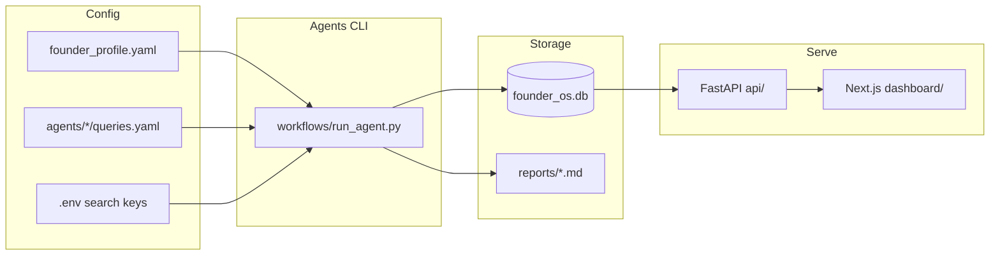

# Founder OS

Internal operating system for solo founders — agents discover funding, investors, grants, and competitions; **Funding Scout** ranks opportunities against your founder profile; a Next.js dashboard surfaces what matters.

## Architecture



## Prerequisites

- Python **3.12+**
- Node **18+** (dashboard)
- At least one search API key for live agent runs (see [.env.example](.env.example))

## Structure

```
founder-os/
├── config/          # founder_profile.yaml
├── agents/          # Domain agents (funding, investors, grants, …)
├── workflows/       # CLI runner + GitHub Actions
├── storage/         # SQLite database + raw exports
├── reports/         # Generated markdown digests
├── dashboard/       # Next.js UI
├── api/             # FastAPI backend
└── lib/             # Shared DB, search, schemas
```

## Quick start

From the repo root:

### 1. Backend

```bash
python -m venv .venv
source .venv/bin/activate
pip install -r requirements.txt
cp .env.example .env
uvicorn api.main:app --reload
```

Or without activating the venv:

```bash
./workflows/run_api.sh
```

Use the project `.venv` — system `uvicorn` will fail with `ModuleNotFoundError: No module named 'dotenv'`.

API docs: http://localhost:8000/docs

Demo seed data populates the dashboard on first API start when `SEED_DEMO_DATA=true`.

### 2. Dashboard

```bash
cd dashboard
npm install
cp .env.local.example .env.local
npm run dev
```

Dashboard: http://localhost:3000

### 3. Run agents

```bash
# Ranked scout (recommended first run)
python workflows/run_agent.py --agent funding_scout

# Daily scan: funding_scout, grants, opportunities, funding
python workflows/run_agent.py --daily

# Weekly scan: investors, research
python workflows/run_agent.py --weekly

# All agents
python workflows/run_agent.py --all
```

Add search API keys to `.env` before running agents against live search:

- `TAVILY_API_KEY`
- `SERPAPI_KEY`
- `GOOGLE_CSE_KEY` + `GOOGLE_CSE_CX`

Without keys, agents run but return no search results. The dashboard still works via demo seed data.

## Configuration

### Environment

Copy [.env.example](.env.example) to `.env`:

| Variable | Purpose |
|----------|---------|
| `DATABASE_PATH` | SQLite location (default `storage/founder_os.db`) |
| `API_KEY` | Protects `/api/*` routes |
| `CORS_ORIGINS` | Dashboard origin(s) |
| `TAVILY_API_KEY` / `SERPAPI_KEY` / `GOOGLE_CSE_*` | Search providers |
| `SEARCH_FALLBACK_ORDER` | Provider fallback chain ([lib/search/client.py](lib/search/client.py)) |
| `SEED_DEMO_DATA` | Populate demo rows on API startup |

### Founder profile

Edit [config/founder_profile.yaml](config/founder_profile.yaml) to personalize Funding Scout scores:

- Company stage, geography, and description
- Ranking weights under `priorities` (stage fit, AI focus, education, etc.)
- Keyword signals used by [lib/scout/ranker.py](lib/scout/ranker.py)

## Agents

| Agent | Schedule | Output | Doc |
|-------|----------|--------|-----|
| `funding_scout` | Daily | `scout_opportunities`, `reports/scout_*.md` | [agents/funding_scout/README.md](agents/funding_scout/README.md) |
| `grants` | Daily | `grants` | [agents/grants/README.md](agents/grants/README.md) |
| `opportunities` | Daily | `competitions` | [agents/opportunities/README.md](agents/opportunities/README.md) |
| `funding` | Daily | `funding_opportunities` | [agents/funding/README.md](agents/funding/README.md) |
| `investors` | Weekly | `investors` | [agents/investors/README.md](agents/investors/README.md) |
| `research` | Weekly | `reports/research_*.md` | [agents/research/README.md](agents/research/README.md) |
| `crm` | Manual | `contacts` (stub) | [agents/crm/README.md](agents/crm/README.md) |
| `social` | Manual | stub | [agents/social/README.md](agents/social/README.md) |

`crm` and `social` are stubs — extend them or ignore until needed. New agents inherit from [lib/agents/base.py](lib/agents/base.py).

## Dashboard

| Route | Description |
|-------|-------------|
| `/` | Overview stats and upcoming deadlines |
| `/scout` | Ranked scout picks (scores, categories) |
| `/funding` | Funding opportunities |
| `/investors` | Investors |
| `/grants` | Grants |
| `/competitions` | Competitions and pitch events |
| `/deadlines` | Upcoming deadlines across sources |

## API endpoints

Interactive docs: http://localhost:8000/docs

| Method | Path | Description |
|--------|------|-------------|
| GET | `/health` | Health check |
| GET | `/api/stats` | Dashboard counts |
| GET | `/api/scout` | Ranked scout opportunities (`category`, `min_score` filters) |
| GET | `/api/investors` | List investors |
| GET | `/api/funding` | List funding opportunities |
| GET | `/api/grants` | List grants |
| GET | `/api/competitions` | List competitions |
| GET | `/api/deadlines?days=30` | Upcoming deadlines |
| GET | `/api/contacts` | CRM contacts |
| GET | `/api/agents` | List agent names |
| POST | `/api/agents/run/{name}` | Trigger an agent |
| POST | `/api/agents/run-all` | Run all agents |

All `/api/*` routes require header: `X-API-Key: dev-local-key` (or your `API_KEY`).

## GitHub Actions

Configure secrets in your repo:

| Secret | Purpose |
|--------|---------|
| `TAVILY_API_KEY` | Tavily search |
| `SERPAPI_KEY` | SerpAPI search |
| `GOOGLE_CSE_KEY` | Google Custom Search |
| `GOOGLE_CSE_CX` | Google CSE engine ID |

Workflows:

- **Daily Scan** — `funding_scout`, grants, opportunities, funding (6am UTC)
- **Weekly Digest** — investors, research (Mon 8am UTC)
- **Manual Agent Run** — pick an agent from the Actions tab

Note: the Manual Agent Run workflow does not yet list `funding_scout` as a choice — use the CLI or extend [.github/workflows/manual_run.yml](.github/workflows/manual_run.yml) if needed.

## Customization

1. Edit [config/founder_profile.yaml](config/founder_profile.yaml) for your stage and thesis
2. Tune search queries in `agents/*/queries.yaml`
3. Run `python workflows/run_agent.py --agent funding_scout` and review `/scout`
4. Set `SEED_DEMO_DATA=false` once live data is flowing
5. Push to a private repo and configure Actions secrets for scheduled scans
